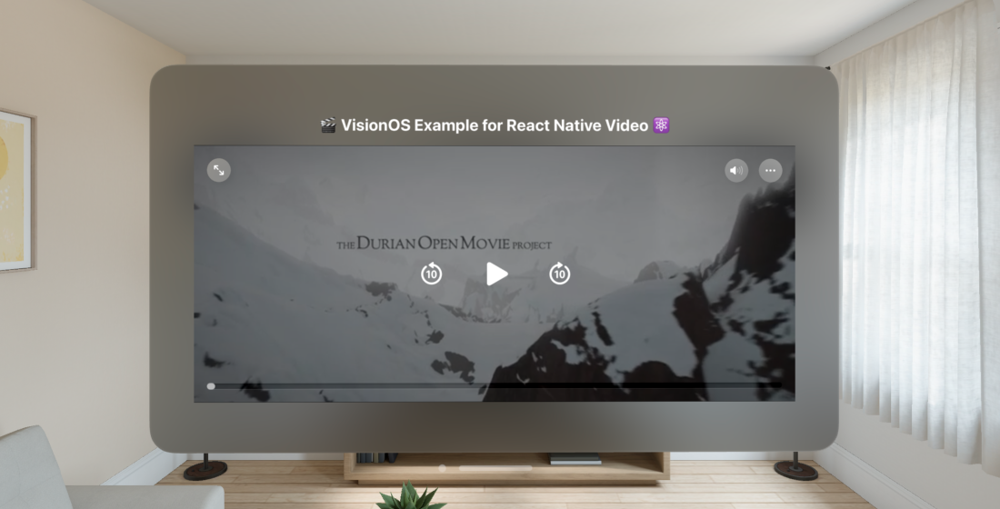
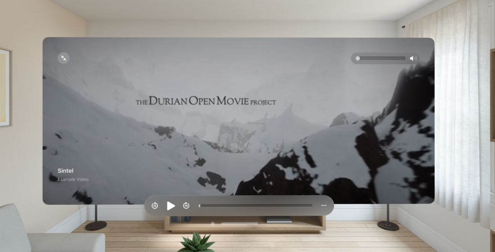

<div align="center">
  <h1 align="center"> 🎬 VisionOS Example for React Native Video ⚛</h1>
</div>

## ➡️ Introduction

From version `6.0.0-beta.4`, react-native-video introduce experimental support for **VisionOS** platform. This is an example project that shows how to use it.

## 🏹 Requirements

To run visionOS you will need to have installed:
- Vision Pro Simulator
- Xcode 15.2

More information please check here: [https://github.com/callstack/react-native-visionos](https://github.com/callstack/react-native-visionos)

## 🚀 Installation

If you want to use make this in your project you can follow steps in docs: [https://react-native-video.github.io/react-native-video/installation](https://react-native-video.github.io/react-native-video/installation)

To install this example project, clone this repository and install dependencies:

```sh
yarn install
cd visionos
bundle install
pod install
cd ..
yarn visionos
```

## 🖼️ Screenshots

<p align="center">
    
&nbsp;
    
</p>

## 🏢 Made by TheWidlarzGroup

Supported by TheWidlarzGroup - the group of React Native Special Task Forces. If you like it -> give it a star!

E-mail us if you have any questions or just want to talk <hi@thewidlarzgroup.com>

## 🤝 Can I hire you?

📱 TWG provides both free and commercial support for this project. Feel free to contact us 🤝 to build something awesome together! 🚀

You can request a consultation via this form 😎
[Contact us](https://thewidlarzgroup.involve.me/new-project)

## 🌐 Follow us

Stay up to date with news, follow us on [Twitter](https://twitter.com/WidlarzGroup) or [Linkedin](https://www.linkedin.com/company/the-widlarz-group/mycompany/)

<a href="https://thewidlarzgroup.com/">
  <picture>
    <source media="(prefers-color-scheme: dark)" srcset="./assets/baners/twg-dark.png" />
    <source media="(prefers-color-scheme: light)" srcset="./assets/baners/twg-light.png" />
    
  </picture>
</a>
